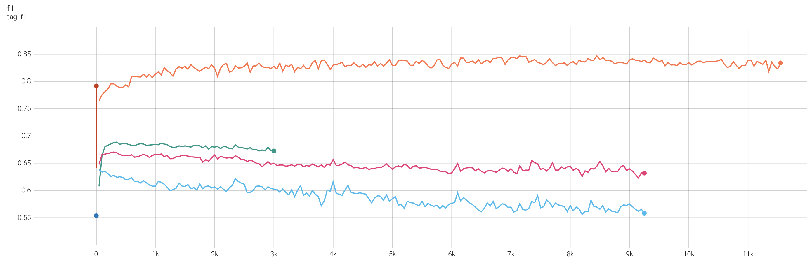

# Shopee-Price Match Guarantee（虾皮同款商品匹配）

## 比赛简介
[Shopee-Price Match Guarantee](https://www.kaggle.com/c/shopee-product-matching/overview) 是Shopee（虾皮）发起的同款商品匹配的比赛，
可用于同款商品匹配，商品比价等场景。

### 数据集
训练集（34250条数据）格式如下，每条数据包含5个字段：
- posting_id:商品编号
- image:商品的图片文件名
- image_phash:商品图片的哈希值
- title:商品标题
- label_group:商品类别

<!--
|posting_id|image|image_phash|title|label_group|
| ----  | ----  | ----  |  ----  | ----  |
|train_129225211|0000a68812bc7e98c42888dfb1c07da0.jpg|94974f937d4c2433|Paper Bag Victoria Secret|249114794|
|train_3386243561|00039780dfc94d01db8676fe789ecd05.jpg|af3f9460c2838f0f|Double Tape 3M VHB 12 mm x 4,5 m ORIGINAL / DOUBLE FOAM TAPE|2937985045|
|train_2288590299|000a190fdd715a2a36faed16e2c65df7.jpg|b94cb00ed3e50f78|Maling TTS Canned Pork Luncheon Meat 397 gr|2395904891」
-->

测试集（3条数据样例）格式如下：
- posting_id:商品编号
- image:商品的图片文件名
- image_phash:商品图片的哈希值
- title:商品标题

<!--
*[·-·]:|posting_id|image|image_phash|title|
*[·-·]:| ----  | ----  | ----  |  ----  |
*[·-·]:|test_2255846744|0006c8e5462ae52167402bac1c2e916e.jpg|ecc292392dc7687a|Edufuntoys - CHARACTER PHONE ada lampu dan musik/ mainan telepon|
*[·-·]:|test_4015706929|0008377d3662e83ef44e1881af38b879.jpg|ba81c17e3581cabe|READY Lemonilo Mie instant sehat kuah dan goreng|
-->

### 评价指标
对于测试集中的每个商品，预测出其对应的同款商品的posting_id列表，上限为50个。对于每个商品的F1得分取平均，得到最终的F1得分。


## 项目简介
为了验证对比学习的有效性，本项目使用对比学习的方式对title进行相似度建模，本项目只使用了title信息，没有引入商品图片信息。

训练目的：对于每个batch中的每个样本，拉近其与正样本之间的距离，拉远其与负样本之间的距离，使得模型能够学习到文本之间的相似关系。

对比学习的难点在于正样本的构造，本项目分别验证了有监督与无监督的效果：
- 有监督对比训练：相同label_group的样本可以看做互为正样本
- 无监督对比训练：对于每个title，使用dropout的方式进行正样本增强


## 数据处理
由于比赛中，只公开了训练集，测试集为黑盒测试集，也就是说没有公开测试集。为了在本地验证方法的有效性，我们将原有的训练集切分为三部分：训练集、验证集、测试集（后续的数据集名称均以此为准）。

原有训练集包含34250条数据，11014个label_group。我们随机取500个label_group的数据作为验证集，1000个label_group的数据作为测试集，剩下9514个label_group作为最终的训练集。
最终的数据分布：
- 训练集：29693条数据，分别属于9514个label_group
- 验证集：1499条数据，分别属于500个label_group
- 测试集：3058条数据，分别属于1000个label_group

可以直接运行脚本preprocess_data.py进行数据集的划分（由于是随机划分的，每次的划分结果均不同），也可以直接使用data/shopee目录下已经划分好的数据集进行实验验证，本项目的实验结果基于该目录下的数据集。


## 运行环境
python==3.6、transformers==3.1.0、torch==1.8.0

运行下面脚本安装依赖环境：
```
pip install -r requirements.txt
```


## 项目结构
- data：存放训练数据
    - shopee：虾皮数据集
        - dev.csv：验证集
        - test.csv：测试集
        - train.csv:训练集
- output:输出目录 ，包括训练日志、tensorboard输出、模型保存等
- pretrain_model：预训练模型存放位置
- script：脚本存放位置。
- dataset.py
- model.py：模型代码
- train.py:训练代码
- preprocess_data.py:切分数据集


## 使用方法
### Quick Start

无监督训练，运行脚本
```
bash script/run_unsup_train.sh
```
有监督训练，运行脚本
```
bash script/run_sup_train.sh
```

## 实验总结
使用余弦距离衡量title之间的相似度，在训练时，threshold设为0.3，也就是当两个title之间的余弦距离小于0.3时，认为两个商品为同款，从而计算验证集的F1、Precision与Recall，进行checkpoint保存。

### 有监督与无监督实验对比
下表为threshold=0.3时，各模型的实验效果，从下表可得出以下结论：
- 在有监督训练中，模型能够更好对title的相似性进行建模，效果远比无监督训练要好。
- 在无监督训练中，dropout为0.3的时候，训练效果比0.1与0.2更好。（玄学调参，在[SimCSE实验复现](https://github.com/yangjianxin1/SimCSE) 项目中，我们得出的结论是dropou=0.2为最佳）

|  训练方法|learning rate  | batch size  | dropout | save step|验证集F1| 验证集Precision|验证集Recall|测试集F1|测试集Precision|测试集Recall|
| ----  | ----  | ----  |  ----  | ----  | ----  | ----  |  ----  | ----  | ----  | ----  | 
|有监督| 3e-5  | 64 |0.1|7150|__0.847__|0.901|0.860|__0.791__|0.809|0.876|
|无监督| 3e-5  | 64 |0.1|50|0.638|0.967|0.532|0.628|0.919|0.554|
|无监督| 3e-5  | 64 |0.2|300|0.670|0.976|0.566|0.674|0.954|0.586|
|无监督| 3e-5  | 64 |0.3|350|0.689|0.970|0.594|0.680|0.939|0.604|


### Threshold分析
对于有监督训练，threshold的取值，对结果的影响如下：

|threshold|测试集F1|测试集Precision|测试集Recall|
| ----  | ----  |  ----  | ----  |
|0.4|0.704|0.642|0.932|
|0.3|0.791|0.809|0.876|
|0.27|0.793|0.837|0.849|
|0.26|0.796|0.849|0.842|
|0.25|__0.797__|0.859|0.834|
|0.24|0.796|0.868|0.824|
|0.23|0.794|0.876|0.813|
|0.2|0.781|0.900|0.770|
|0.1|0.689|0.968|0.597|


### 训练过程分析
训练过程中，各个模型在验证集上的F1得分的变化曲线如下图，可以看到，有监督训练比无监督训练的效果更好：

|颜色|训练方法|dropout|
| ----  | ----  |  ----  |
|橙色|有监督|0.1|
|绿色|无监督|0.3|
|粉色|无监督|0.2|
|蓝色|无监督|0.1|




## REFERENCE
- https://github.com/yangjianxin1/SimCSE
- https://arxiv.org/pdf/2104.08821.pdf
- https://github.com/princeton-nlp/SimCSE
- https://kexue.fm/archives/8348
- https://github.com/bojone/SimCSE

## TODO
- 验证模型在黑盒测试集上的效果
- 使用Faiss，实现一个简单的同款商品检索功能


